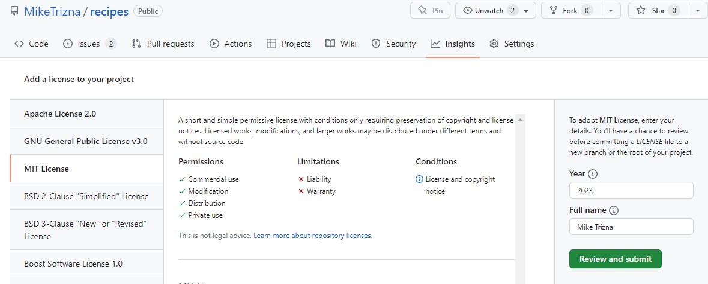

# Choosing a license

## Why you should choose a license

From the [GitHub documentation](https://docs.github.com/en/repositories/managing-your-repositorys-settings-and-features/customizing-your-repository/licensing-a-repository), which are licensed under "Creative Commons Attribution 4.0 International":

"You're under no obligation to choose a license. However, without a license, the default copyright laws apply, meaning that you retain all rights to your source code and no one may reproduce, distribute, or create derivative works from your work."

## Licenses for software and non-software

Keep in mind that GitHub was originally designed to keep track of software source code, so most of the guidance you will see about licenses on GitHub are geared towards software. However, it is important to distinguish between software and non-software "creative works".

Non-software creative works are typically licensed under one of the Creative Commons licenses. The Creative Commons specifically recommends against using Creative Commons licenses for software: [https://creativecommons.org/faq/#can-i-apply-a-creative-commons-license-to-software](https://creativecommons.org/faq/#can-i-apply-a-creative-commons-license-to-software).

## Choosing a license on GitHub

Even though we skipped choosing a license in the initial GitHub "New Repository" interface, we can still access a special license selection helper.

From the main repository, click "Add File" and then "Create new file". You should see an interface similar to when you created guacamole.md in the previous section.

In the "Name your file" box, type in LICENSE. A "Choose your license template" icon should show up.

Click this.

You will see a popup asking if it's ok to discard changes. We haven't added anything yet, so that's ok.

You will now see a really nice interface that shows the most often used licenses on GitHub, some summary information about each license, the full text, and an option to add your name to the license.

Click on a few licenses to see how they differ.

At the Smithsonian, if you are not a federal employee, we recommend either the MIT License or Apache License. See if you can figure out why.

If you are a federal employee and code was written as part of your official duties, then your code cannot be copyrighted. An agency-specific example of this can be seen in [license of the popular BLAST software](https://www.ncbi.nlm.nih.gov/IEB/ToolBox/CPP_DOC/lxr/source/scripts/projects/blast/LICENSE), which is distributed by the NIH. This license is very similar to the "Unlicense". Check that one out.

For our specific use case of publishing a recipe, this is not software code so we can narrow down to one of the Creative Common licenses. 

It is actually established US law that food recipes are ["uncopyrightable"](https://www.copyright.gov/circs/circ33.pdf). So for this case, we should choose the "Creative Commons Zero" license, which basically says we claim no copyright.

Choose this license, and then click "Review and submit" to get back to load the CC0 license text, and return to the normal Edit File interface.

Click "Commit Changes" to add this license to your repository.

