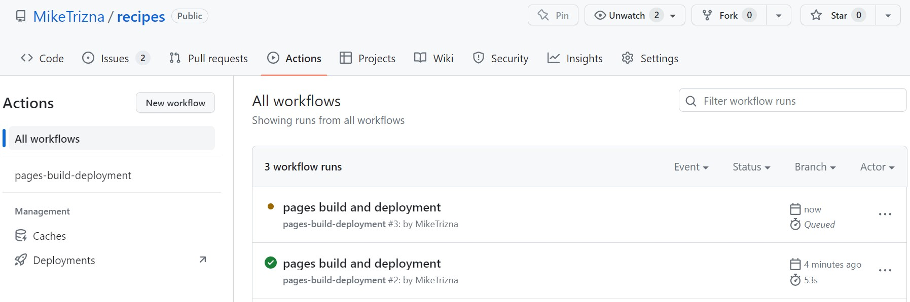
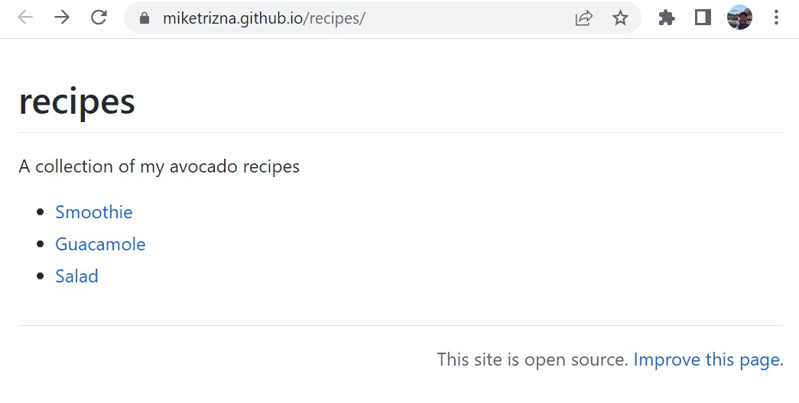

# Hosting websites on GitHub Pages

You can host your personal homepage or group webpage
or project website on GitHub using
[GitHub Pages](https://pages.github.com/).

[GitLab](https://about.gitlab.com/features/pages/) and
[Bitbucket](https://confluence.atlassian.com/bitbucket/publishing-a-website-on-bitbucket-cloud-221449776.html)
also offer a very similar solution.

Unless you need user authentication or a sophisticated database behind your website,
[GitHub Pages](https://pages.github.com/) can be a very nice alternative
to running your own web servers.

## Step 0: Add links to your recipes in README.md

*(This is from Step 3 of [Making changes with GitHub Desktop](https://miketrizna.github.io/github-without-command-line/gh-desktop-changes.html#step-3-make-a-conflicting-change), so you may have already done this)*

Go back to your initial recipes repository, and edit your README.md file so that you have links to your separate recipe markdown files.

Here is sample text to include:

```
# Avocado Recipes
A collection of my avocado recipes

* [Smoothie](avocado_smoothie.md)
* [Guacamole](guacamole.md)
* [Salad](avocado_tomato_salad.md)

```

Commit these changes.

## Step 1: Tell GitHub to make your pages

We need to tell GitHub how to make your repository into a website.

Click on the Settings gear icon up top, and then click on the Pages section on the left side panel.


Click on the dropdown under Branch, and select "main" to tell GitHub to build a webpage from the "main" branch. Then make sure that "/root" is selected in the new dropdown that will populate. Click Save to make the web page build.


## Step 2: Watch GitHub build your page live

Right after clicking Save, GitHub will start building your page using GitHub Actions (we could do a whole extra workshop on GitHub Actions).

Click on the Actions icon on the top menu to see that a "workflow" has been triggered called "pages build and deployment".



If you clicked on the Actions tab fast enough, the circle next to the worflow name should be brown or yellow.

Click on the "pages build and deployment" link. If the build was successful, all parts of the worlflow should show a green circle. And most importantly, the "deploy" portion should have a link to your new website!


Click on that link (it should follow the pattern `https://[your username].github.io/recipes`). You should see a pretty basic webpage, but it's completely built from the contents of your GitHub repository!



